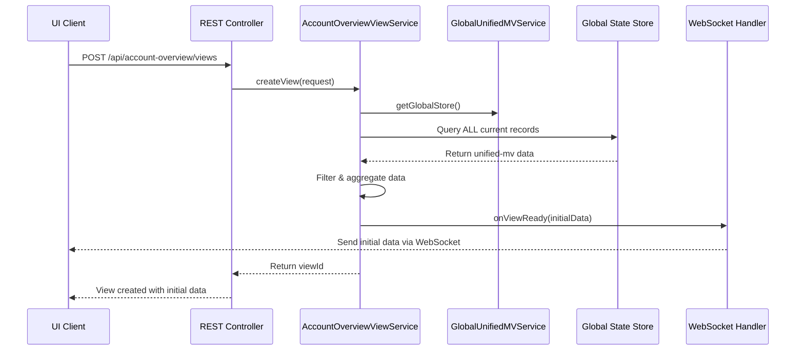
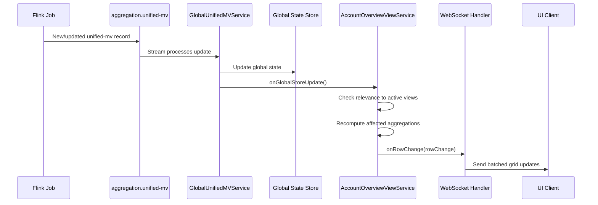

# Global State Store Implementation for View Server

## Overview

This implementation introduces a **Global State Store pattern** for the Account Overview views, solving the fundamental issue of new views starting with empty state and requiring time to populate.

## 🎯 Key Benefits

### Before (Individual Kafka Streams per View)
- ❌ **New views start empty** - require time to process entire topic history
- ❌ **Resource intensive** - separate KafkaStreams instance per view  
- ❌ **Slow startup** - each view processes all historical data
- ❌ **No current state access** - views only see new updates
- ❌ **Poor user experience** - views appear broken initially

### After (Global State Store)
- ✅ **Instant view creation** - current state available immediately
- ✅ **Resource efficient** - single shared KafkaStreams instance
- ✅ **Fast startup** - views query existing global state
- ✅ **Current state access** - views start with complete current data
- ✅ **Excellent user experience** - views are immediately useful

---

## 🏗️ Architecture Components

### 1. GlobalUnifiedMVService
**Location**: `view-server/src/main/java/com/viewserver/computation/streams/GlobalUnifiedMVService.java`

**Responsibilities**:
- Maintains a **single global Kafka Streams topology**
- Creates a **Global State Store** containing ALL current unified-mv records
- Provides a **change stream** for real-time updates
- Manages **change listeners** for view notifications

**Key Features**:
```java
// Global State Store - contains ALL current unified-mv data
GlobalKTable<String, UnifiedMarketValue> globalTable = builder.globalTable(
    unifiedMvTopic,
    Materialized.as(GLOBAL_STORE_NAME)
);

// Change Stream - notifies views of updates
KStream<String, UnifiedMarketValue> changeStream = builder.stream(unifiedMvTopic)
    .mapValues(this::parseUnifiedMV)
    .filter((key, value) -> value != null)
    .foreach(this::handleGlobalStoreUpdate);
```

### 2. AccountOverviewViewService (Redesigned)
**Location**: `view-server/src/main/java/com/viewserver/computation/streams/AccountOverviewViewService.java`

**Responsibilities**:
- Creates **logical views** by querying the global state store
- Provides **instant access** to current aggregated state
- Handles **real-time updates** via change listener pattern
- Manages **view lifecycle** without individual Kafka Streams

**Key Features**:
```java
// INSTANT view creation with current state
public String createView(AccountOverviewRequest request) {
    // 🚀 INSTANTLY compute current state from global store
    List<AccountOverviewResponse> initialData = computeCurrentViewState(viewId, config);
    // Notify listener of immediate data availability
    listener.onViewReady(viewId, initialData);
}

// Real-time updates from global store changes
@Override
public void onGlobalStoreUpdate(UnifiedMarketValue updatedRecord) {
    // Check each active view for relevance
    // Recompute affected aggregations  
    // Send WebSocket updates
}
```

### 3. ViewConfiguration Model
**Location**: `view-server/src/main/java/com/viewserver/computation/model/ViewConfiguration.java`

**Purpose**: Stores view configuration without Kafka Streams topology

### 4. Updated WebSocket Handler
**Location**: `view-server/src/main/java/com/viewserver/websocket/handlers/AccountOverviewWebSocketHandler.java`

**Changes**:
- Implements `AccountOverviewViewService.ViewChangeListener`
- Receives real-time updates from Global State Store
- Provides immediate data refresh capabilities

### 5. REST Controller
**Location**: `view-server/src/main/java/com/viewserver/computation/controller/AccountOverviewController.java`

**New Endpoints**:
- `POST /api/account-overview/views` - Create view (instant response)
- `GET /api/account-overview/global-store/stats` - Global store statistics
- `GET /api/account-overview/health` - Service health including global store status

---

## 🔄 Data Flow

### View Creation Flow


### Real-Time Update Flow


---

## 🚀 Implementation Benefits

### Performance Benefits
1. **Instant View Creation**: New views get current state immediately (< 100ms vs minutes)
2. **Shared Resources**: Single KafkaStreams instance vs N instances
3. **Memory Efficiency**: One global store vs multiple state stores
4. **Reduced Topic Processing**: No need to replay entire topic per view

### User Experience Benefits
1. **Immediate Data**: Views show current data instantly
2. **Consistent State**: All views see the same current state
3. **Real-time Updates**: Changes propagate to all relevant views
4. **Better Error Handling**: Centralized error management

### Operational Benefits
1. **Simplified Monitoring**: Single streams topology to monitor
2. **Easier Debugging**: Centralized state management
3. **Resource Predictability**: Fixed resource usage regardless of view count
4. **Better Scalability**: Handles many views efficiently

---

## 📊 Global Store Statistics

The implementation provides comprehensive monitoring via `/api/account-overview/global-store/stats`:

```json
{
  "ready": true,
  "recordCount": 847,
  "holdingCount": 432,
  "orderCount": 415,
  "streamState": "RUNNING"
}
```

---

## 🔧 Configuration

### Key Configuration Points

1. **Global Store Name**: `global-unified-mv-store`
2. **Application ID**: `global-unified-mv-service`
3. **Topic**: `aggregation.unified-mv` (from system-config.yml)
4. **Update Batching**: 100ms intervals for WebSocket updates

### Memory Configuration
```java
props.put(StreamsConfig.CACHE_MAX_BYTES_BUFFERING_CONFIG, 10 * 1024 * 1024); // 10MB cache
```

---

## 🎮 Usage Examples

### Create a View
```bash
curl -X POST http://localhost:8080/api/account-overview/views \
  -H "Content-Type: application/json" \
  -d '{
    "userId": "user123",
    "viewName": "My Portfolio",
    "selectedAccounts": ["ACC001", "ACC002"],
    "groupByFields": ["instrumentName", "currency"]
  }'
```

**Response** (immediate):
```json
{
  "status": "success",
  "viewId": "view_1703123456789_a1b2c3d4",
  "message": "View created successfully",
  "initialRowCount": 42,
  "globalStoreStats": {
    "ready": true,
    "recordCount": 847
  }
}
```

### WebSocket Connection
```javascript
const ws = new WebSocket('ws://localhost:8080/ws/account-overview/view_1703123456789_a1b2c3d4');

ws.onmessage = function(event) {
    const message = JSON.parse(event.data);
    
    switch(message.type) {
        case 'VIEW_READY':
            // Initial data available immediately
            console.log('Initial data:', message.initialData);
            break;
            
        case 'GRID_UPDATE':
            // Real-time updates from Global State Store
            console.log('Updates:', message.changes);
            break;
    }
};
```

---

## 🔍 Monitoring & Health

### Health Check
```bash
curl http://localhost:8080/api/account-overview/health
```

### Service Status Indicators
- ✅ **Global Store Ready**: Can create views
- ⚠️ **Global Store Not Ready**: Service starting up
- ❌ **Global Store Error**: Service needs restart

---

## 🚨 Error Handling

### Graceful Degradation
- If Global Store not ready: Return appropriate error message
- If view not found: Return 404 with clear message  
- If WebSocket connection fails: Automatic reconnection support
- If aggregation fails: Error sent to WebSocket client

### Automatic Recovery
- Global Store automatically rebuilds from Kafka on restart
- Views automatically refresh when Global Store becomes available
- WebSocket connections auto-reconnect on network issues

---

## 🔮 Future Enhancements

### Potential Improvements
1. **Persistent Global Store**: Use RocksDB for faster restarts
2. **Horizontal Scaling**: Distribute global store across instances
3. **Caching Layer**: Add Redis cache for frequently accessed aggregations
4. **View Materialization**: Pre-compute common view patterns
5. **Delta Compression**: Optimize WebSocket message sizes

### Monitoring Enhancements
1. **Metrics Integration**: Prometheus/Grafana dashboards
2. **Performance Tracking**: View creation time, update latency
3. **Resource Monitoring**: Memory usage, processing rates
4. **Alerting**: Global store health, view creation failures

---

This implementation provides a robust, scalable foundation for real-time portfolio views with instant data availability and efficient resource utilization. The Global State Store pattern eliminates the fundamental UX issue while providing better performance characteristics for both users and operations teams. 